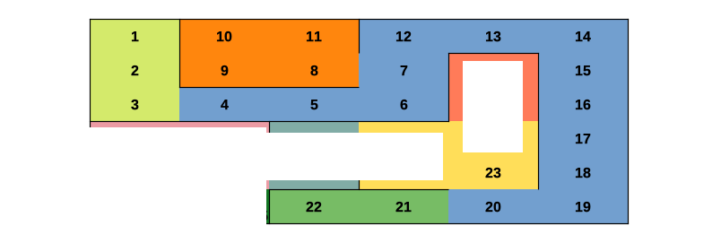

# Adventures of Dreamland

# Definitions

## Zones

Each zone is made up of multiple rooms. The number of rooms in each zone can vary. Each zone is denoted by a colour on the map. Each zone will have one puzzle, except for the hallways (blue on the map)

### Rooms

Rooms are subsets of a zone. Each room will have at least one item in it, although they can have more. 

# Gameplay

You start in the *Light Yellow* zone. It is in fact three separate rooms you can explore. The game progresses as you explore the maze, until you can get out of it.

## Items

There are multiple types of items. Puzzle pieces, keys, key fragments and puzzles are the primary types of items, but you may also find other kinds of items, such as Hints. 

### Puzzle Pieces

Puzzle pieces are items that you can find strewn around each zone. In order to use them, you have to find a puzzle. 

### Puzzles

Puzzles are also items, as mentioned previously. Puzzles require you to find puzzle pieces, and put them into the puzzle in order to solve it. Hints will be scattered around the map to help you solve these puzzles. However, the hints will require you to look closely and use some puzzle solving skills to decipher them and actually make them usable.

### Keys 

There is only one key in the game. How do you find it? Can't tell you.

Where's the key used? Can't tell you that. You'll have to figure that out yourself. 

## Special Items

Special Items are also the other kind of item you can find in the game. They include things such as Hints, and clues. 

## Hints

Hints will help you solve the puzzles, but beware, as the hints might not be so obvious. Maybe you need a clue in order to find the hint?

## Clues

Clues help you solve hints. That's all I'm going to give you though. 

# Game Map
